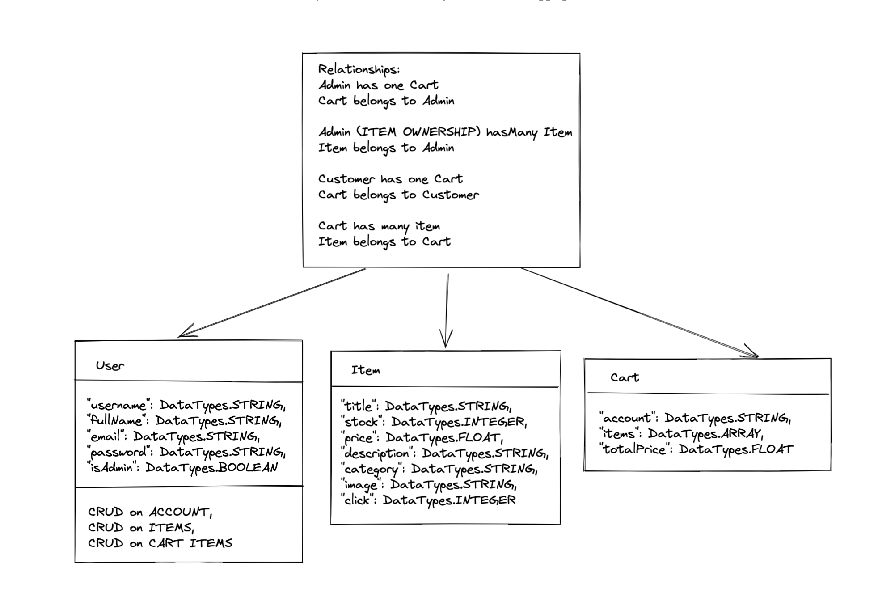
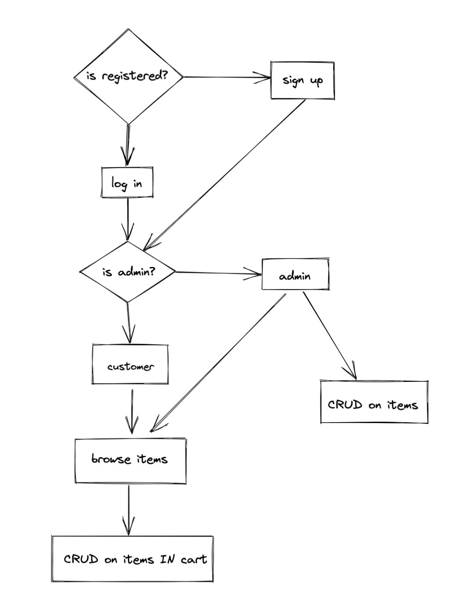

# E-COMMERCE APP

## Table of Contents

- [Requirements](#Requirements)
- [Diagrams](#Diagrams)
- [Mock Ups](./public/assets/mockup)
- [Built With](#Built-With)
- [Installation](#Installation)
-  [Available Scripts](#Available-Scripts)
- [Future Features](#Future-Features)

## Requirements

| [x]  | ID   | Priority | Description                                                  |
| ---- | ---- | -------- | ------------------------------------------------------------ |
| [x]  | F1   | MUST     | The application must support at least 4 categories; *electronics, jewelery, men's clothing, women's clothing* |
| [x]  | F2   | MUST     | The application must display as a minimum, an image, price and description of each item |
| [x]  | F3   | MUST     | The application must allow for items to be added to a shopping cart |
|      | F4   | MUST     | The application must allow for items to be deleted from a shopping cart |
| [x]  | F5   | MUST     | The shopping cart must persist its state when the browser is closed |
| [x]  | F6   | MUST     | The application must work well on a mobile as well as a desktop device |
| [x]  | F6   | SHOULD   | (optional) The application should support an admin interface to allow for new items to be uploaded for sale |
| [x]  | F7   | SHOULD   | (optional) The application should support an admin interface to allow for item descriptions to be updated |
| [x]  | F8   | SHOULD   | (optional) The application should support an admin interface to allow for items to be removed from sale |
|      | NF1  | MUST     | The application must have client & server-side validation in place |
|      | NF2  | MUST     | The application must have evidence of automated unit testing |
| [x]  | NF3  | MUST     | The application code must be documented in a manner that it would be easy for a new developer to understand |
| [x]  | NF4  | MUST     | The application code must be stored in a GitHub repository   |

## Diagrams





## Built With

- [VS Code](https://code.visualstudio.com/)
- [npm](https://www.npmjs.com/)
- [NodeJS](https://nodejs.org/en/)
- [Express](https://expressjs.com/)
- [Express Handlebars](https://www.npmjs.com/package/express-handlebars)
- [Jest](https://jestjs.io/)
- [Nodemon](https://nodemon.io/)
- [SQLite](https://www.sqlite.org/index.html)
- [Sequelize](https://sequelize.org/master/manual/getting-started.html)

## Installation

1. Clone the repository

```bash
git clone https://github.com/Week-5/ecommerce.git
```

2. Change the working directory

```bash
cd ${PATH}/ecommerce
```

3. Install dependencies

```bash
npm install
```

## Available Scripts
In the project directory, you can run:

```bash
npm start
```
Runs the app in the development mode.<br />
Open [http://localhost:3000/homepage](http://localhost:3000/homepage) to view it in the browser.
The page will reload if you make edits.
You will also see any lint errors in the console.

```bash
npm test
```
Launches the test runner in the interactive watch mode.<br />
See the section about [running tests](https://www.npmjs.com/package/jest) for more information.

## Future Features

